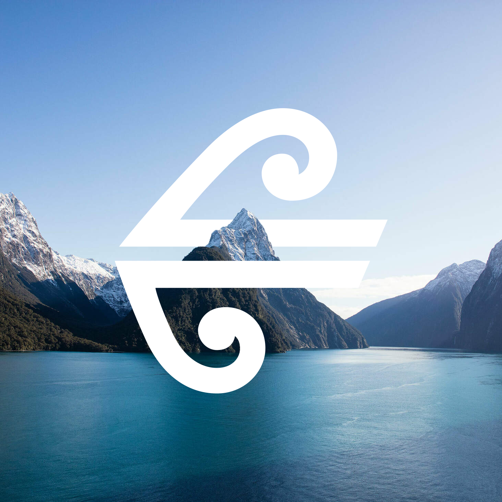
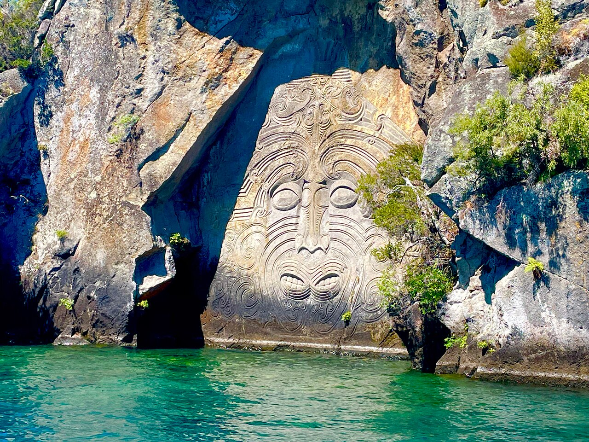

::: {.callout-note appearance="simple"}

## Page under construction

:::

**Kia ora all,**

Our wedding will be held on the 23rd of January, 2027 NZDT. The venue will be our house - 23 Kererū street, Taupō, New Zealand.

This site is intended to give you some details about logistics, and to help keep everyone organised. In particular to the yanks coming all this way - I appreciate that NZ is a long way to travel for a wedding, especially for those with babies, and we want to help as much as we can to make it a smooth trip. Hopefully after visiting you will understand why we have chosen to live here.

## Venue
The ceremony will be held at out house - 23 Kererū street. It's the mansion at the end of the street. Actually it's not, but we should all fit. Most of you have probably seen photos already.

Taupō is a small town in the centre of the north island of NZ. We lived in Dunedin, Wellington, and have now landed here. Taupō is known for it's natural beauty, big ass lake, tourist attractions, proximity to the mountain, etc. The natural beauty highlights include geothermal pools, the maunga Ruapehū, and swimming holes. Although there are many tourists, it still feels like a small town. Lake Taupō is the biggest lake in NZ, and feels a lot like lake Michigan in terms of its clarity and summer temperature. 

Because of the tourist industry there is lots to do. We have bungy jumping, sky diving, river jet boat rides, fly fishing, wine tasting, beaches.. the list is endless really. We have provided the page here which documents our recommendations, but it's also probably best if you just look it up online.

I hope this can be treated as 'forced' vacation for all of you. The word "forced" carrying the meaning that you will feel strongly obliged to take some time of work, and treat yourself to a vacation in our beautiful little sheep overrun country. That said, reiterating I understand this is an expensive trip. If you don't think you can afford this let me know and maybe we can work something out.

## Accommodation
Taupō has many places to stay. We do not have any specific recommendations, but if you are still looking for accommodation recommend the following sites:

[Holiday homes](https://www.holidayhouses.co.nz/)

[Airbnb](https://www.airbnb.co.nz/)

[BookaBatch](https://www.bookabach.co.nz/)

[Google some hotels (:](https://www.google.com/travel/search?q=hotels&g2lb=4965990%2C72471280%2C72560029%2C72573224%2C72647020%2C72686036%2C72803964%2C72882230%2C73064764%2C121529350&hl=en-NZ&gl=nz&cs=1&ssta=1&ts=CAESCgoCCAMKAggDEAAaHBIaEhQKBwjqDxAGGAYSBwjqDxAGGAcYATICEAAqBwoFOgNOWkQ&qs=CAE4BEIJEb_iPS6qz44eQgkRJeTXu97yjXg&ap=aAE&ictx=111&ved=0CAAQ5JsGahcKEwiA-NrOs_KUAxUAAAAAHQAAAAAQCw)

Because of the volume of places to stay you can be choosy - and we recommend getting one within a few km's of our house.

## Wedding size
This is going to be a pretty small event with only our closest friends and family invited. Currently there are about 50 people on the list. Exclusive, chic, fashionable :nail_care:.

## Getting to NZ

{width=100% fig-align="left"}

There are a 3 or so airlines that fly to New Zealand direct from U.S.A. We have flown on a few of them - and from these experiences - recommend Air New Zealand. AirNZ has nice planes, service, food, and offer a great option those with babies by the addition to your ticket called the "sky couch". Air New Zealand is also a member of the Star Alliance so you can use points you have accumulated from other Star Alliance airlines (such as United airlines).

AirNZ flies direct to Auckland NZ from Los Angles, San Francisco, New York, Vancouver, and Houston. From Auckland you can fly to Taupō (a 50 min. flight). The flight from Auckland to Taupō is less than $80 USD so that probably makes the most sense. I encourage you to send us your flights before you book them, sometimes the slightly cheaper option will send you the wrong way around the world and be much worse.

## Things to do in Taupō

{width=100% fig-align="left"}

### To eat
- item 1
- item 2
- item 3

### To do
- item 1
- item 2
- item 3

**Ngā mihi,\
John and Ella**
