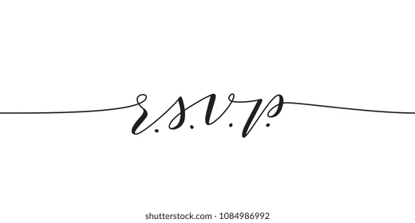

{style="border-radius: 20px;" width=60% fig-align="left"}

[Reply here](https://docs.google.com/forms/d/e/1FAIpQLSdDOogay-pCFfHWBsLNNo4nmejDckpX_rcVVZ1eDfkpwFuFtQ/viewform?usp=publish-editor){.btn .btn-primary role="button"}

\
\
Apparently R.S.V.P. means "répondez s'il vous plaît"
